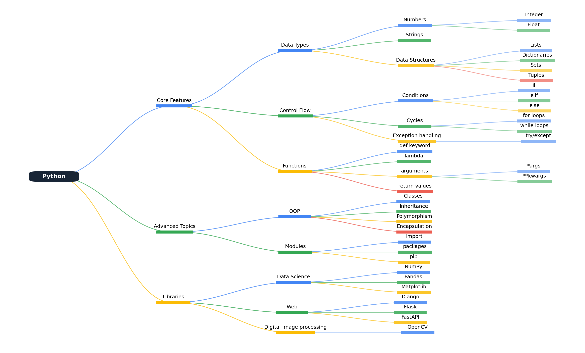

# Python MindMap Generator

A flexible and customizable Python library for creating beautiful mind maps using matplotlib. This library allows you to create professional-looking mind maps with automatic layout, color schemes, and smooth connections between nodes.

## Features

- 🎨 Automatic color scheme generation with gradient support
- 📐 Smart layout algorithm that handles multiple levels and branches
- 🔄 Smooth Bezier curve connections between nodes
- 🎯 Configurable node spacing and dimensions
- 📏 Automatic text sizing and padding
- 💾 Export to various image formats

## Installation

Install via pip:
```bash
pip install mindmap-lib
```

## Usage

Here's a simple example of how to create a mind map:

```python
from mindmap import MindMap, MindMapConfig

# Define your mind map structure
# Format: (root_text, [(child1_text, [grandchildren1]), (child2_text, [grandchildren2]), ...])
mind_map_data = (
    "Project Planning",
    [
        ("Research", [
            ("Market Analysis", []),
            ("Competitor Review", []),
            ("User Surveys", [])
        ]),
        ("Design", [
            ("Wireframes", []),
            ("UI/UX", []),
            ("Prototypes", [])
        ]),
        ("Development", [
            ("Frontend", []),
            ("Backend", []),
            ("Testing", [])
        ]),
        ("Launch", [
            ("Marketing", []),
            ("Deployment", []),
            ("Monitoring", [])
        ])
    ]
)

# Create and customize the mind map
config = MindMapConfig(
    width=15,          # Figure width in inches
    height=10,         # Figure height in inches
    dpi=100,          # Resolution
    x_limits=(-0.5, 11.5),  # X-axis limits
    y_limits=(-4.5, 4.5)    # Y-axis limits
)

# Create the mind map
mind_map = MindMap(config)
mind_map.create(mind_map_data)

# Save to file
mind_map.save("example.png", bbox_inches='tight')

# Or display it
mind_map.show()
```

## Customization

### Color Schemes

The library comes with a default gradient color scheme, but you can create your own by implementing the `ColorScheme` abstract base class:

```python
from mindmap import ColorScheme

class CustomColorScheme(ColorScheme):
    def get_color(self, index: int, level: int) -> str:
        # Your color logic here
        colors = ['#8A4FFF', '#32B679', '#FF8C82', '#FFA726', '#4B7BF5']
        return colors[index % len(colors)]

# Use your custom color scheme
config = MindMapConfig(color_scheme=CustomColorScheme())
```

### Layout Configuration

You can adjust various layout parameters through the `MindMapConfig` class:

```python
config = MindMapConfig(
    text_bar_height=0.3,    # Height of node bars
    text_padding=0.2        # Padding around text
)
```

## Output Example

When you run the example code above, you'll get a mind map that looks like this:



## API Reference

### MindMap Class

Main class for creating mind maps.

#### Methods:
- `create(data: Tuple[str, List]) -> Figure`: Creates a mind map from the given data structure
- `save(filename: str, **kwargs) -> None`: Saves the mind map to a file
- `show() -> None`: Displays the mind map

### MindMapConfig Class

Configuration class for customizing mind map appearance.

#### Parameters:
- `width`: Width of the figure in inches
- `height`: Height of the figure in inches
- `dpi`: Resolution of the output
- `x_limits`: Tuple of (min, max) x-axis limits
- `y_limits`: Tuple of (min, max) y-axis limits
- `text_bar_height`: Height of node bars
- `text_padding`: Padding around text
- `color_scheme`: Instance of ColorScheme for custom colors

## License

This project is licensed under the MIT License - see the LICENSE file for details.
